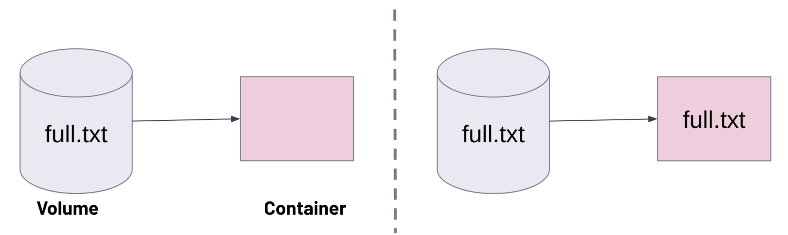
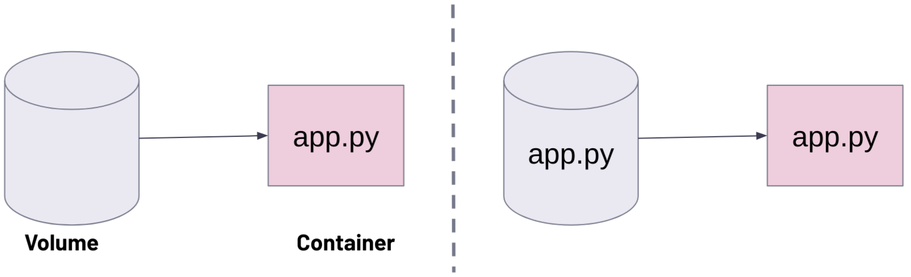
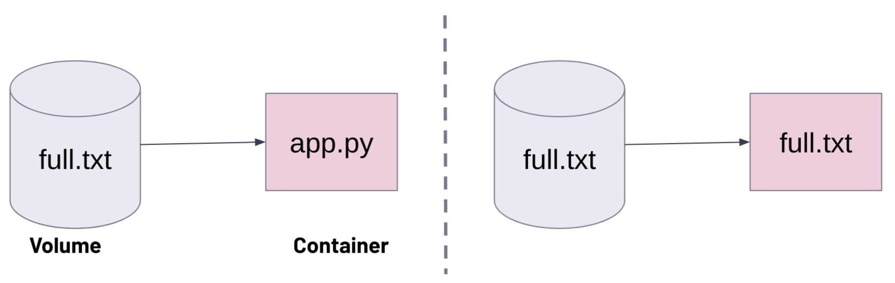

# Hands-on Docker-03 : Handling Docker Volumes

This hands-on training aims to teach students how to handle volumes in Docker containers.

## Learning Outcomes 

At the end of this hands-on training, students will be able to;

- Explain what the Alpine container is and why it is widely used.

- List available volumes in Docker.

- Create a volume in Docker.

- Inspect properties of a volume in Docker.

- Locate the Docker volume mount point.

- Attach a volume to a Docker container.

- Attach the same volume to different containers.

- Delete Docker volumes.

## Outline

- Part 1 - Launch a Docker Machine Instance and Connect with SSH

- Part 2 - Data Persistence in Docker Containers

- Part 3 - Managing Docker Volumes

- Part 4 - Using Same Volume with Different Containers

- Part 5 - Docker Volume Behaviours

- Part 6 - Bind Mounts

- Part 7 - Anonymous Volumes

## Part 1 - Launch a Docker Machine Instance and Connect with SSH

- Launch a Docker machine (t2.micro) on Amazon Linux 2 AMI with a security group allowing SSH connections using the [Cloudformation Template for Docker Machine Installation](../S1A-docker-01-installing-on-ec2-linux2/docker-installation-template.yml).

- Connect to your instance with SSH.

```bash
ssh -i .ssh/mykey.pem ec2-user@ec2-3-133-106-98.us-east-2.compute.amazonaws.com
```

## Part 2 - Data Persistence in Docker Containers

- Check if the Docker service is up and running.

```bash
systemctl status docker
```

- Run an `alpine` container with an interactive shell open, and add a command to run the Alpine shell. Here, explain what the Alpine container is and why it is so popular. (Small size, Secure, Simple, Fast boot)

```bash
docker run -it alpine ash
```

- Display the os-release of the Alpine container.

```bash
cat /etc/os-release
```

- Create a file named `short-life.txt` under `/home` folder

```bash
cd home && touch short-life.txt && ls
```

- Exit the container and return to the ec2-user bash shell.

```bash
exit
```

- Show the list of all containers available on the Docker machine.

```bash
docker ps -a
```

- Start the Alpine container and connect to it.

```bash
docker start 737 && docker exec -it 737 ash
```

- Show that the file `short-life.txt` is still there, and explain why it is there. (Container holds its data until removed).

```bash
ls /home 
```

- Exit the container and return to the ec2-user bash shell.

```bash
exit
```

- Remove the Alpine container.

```bash
docker rm -f 737
```

- Show the list of all containers, and the Alpine container with its data is gone.

```bash
docker ps -a
```

## Part 3 - Managing Docker Volumes

- Explain why we need volumes in Docker.

List the volumes available in Docker, as no volumes were added before, so the list should be empty.

```bash
docker volume ls
```

- Create a volume named `my-vol`.

```bash
docker volume create my-vol
```

- List the volumes available in Docker, and you should see the local volume `my-vol` in the list.

```bash
docker volume ls
```

- Show details and explain the volume `my-vol`. Note the mount point: `/var/lib/docker/volumes/my-vol/_data`.

```bash
docker volume inspect my-vol
```

- List all files/folders under the mount point of the volume `my-vol`, should see nothing listed.

```bash
sudo ls -al  /var/lib/docker/volumes/my-vol/_data
```

- Run an `alpine` container with an interactive shell open, name the container as `mycont`, attach the volume `my-vol` to `/test` mount point in the container, and add a command to run the Alpine shell. Here, explain `--volume` and `v` flags.

```bash
docker run -it --name mycont -v my-vol:/test alpine ash
```

- List files/folders in `mycont` container, show mounting point `/test`, and explain the mounted volume `my-vol`.

```bash
ls
```

- Create a file in `mycont` container under `/test` folder.

```bash
cd my && echo "This file is created in the container mycont" > i-will-persist.txt
```

- List the files in the `/test` folder, and show the content of `i-will-persist.txt`.

```bash
ls && cat i-will-persist.txt
```

- Exit the `mycont` container and return to the ec2-user bash shell.

```bash
exit
```

- Show the list of all containers available on the Docker machine.

```bash
docker ps -a
```

- Remove the `mycont` container.

```bash
docker rm mycont
```

- Show the list of all containers, and the `mycont` container is removed.

```bash
docker ps -a
```

- List all files/folders under the volume `my-vol`, and show that the file `i-will-persist.txt` is there.

```bash
sudo ls -al  /var/lib/docker/volumes/my-vol/_data && sudo cat /var/lib/docker/volumes/my-vol/_data/i-will-persist.txt
```

## Part 4 - Using Same Volume with Different Containers

- Run an `alpine` container with an interactive shell open, name the container as `mycont2`, attach the volume `my-vol` to `/test2` mount point in the container, and add a command to run Alpine shell.

```bash
docker run -it --name mycont2 -v my-vol:/test2 alpine ash
```

- List the files in `/test2` folder, and show that we can reach the file `i-will-persist.txt`.

```bash
ls -l /test2 && cat /test2/i-will-persist.txt
```

- Create another file in `mycont2` container under the `/test2` folder.

```bash
cd test2 && echo "This is a file of the container mycont2" > loadmore.txt
```

- List the files in `/test2` folder, and show the content of `loadmore.txt`.

```bash
ls && cat loadmore.txt
```

- Exit the `mycont2` container and return to the ec2-user bash shell.

```bash
exit
```

- Run a `ubuntu` container with an interactive shell open, name the container as `mycont3`, attach the volume `my-vol` to `/test3` mount point in the container, and add a command to run a bash shell.

```bash
docker run -it --name mycont3 -v my-vol:/test3 ubuntu bash
```

- List the files in `/test3` folder, and show that we can reach all the files created earlier.

```bash
ls -l /test3
```

- Create another file in `mycont3` container under `/test3` folder.

```bash
cd test3 && touch file-from-3rd.txt && ls
```

- Exit the `mycont3` container and return to the ec2-user bash shell.

```bash
exit
```

- Run another `ubuntu` container with an interactive shell open, name the container as `mycont4`, attach the volume `my-vol` as read-only to the `/test4` mount point in the container, and add a command to run a bash shell.

```bash
docker run -it --name mycont4 -v my-vol:/test4:ro ubuntu bash
```

- List the files in `/test4` folder, and show that we can reach all the files created earlier.

```bash
ls -l /test4
```

- Try to create another file under `/test4` folder. Should see the error `read-only file system`

```bash
cd test4 && touch file-from-4th.txt
```

- Exit the `mycont4` container and return to the ec2-user bash shell.

```bash
exit
```

- List all containers.

```bash
docker ps -a
```

- Delete `mycont2`, `mycont3` and `mycont4` containers.

```bash
docker rm mycont2 mycont3 mycont4
```

- Delete `my-vol` volume.

```bash
docker volume rm my-vol
```

## Part 5 - Docker Volume Behaviors

|No | Situation   | Behaviour |
| ---- | ----------- | ------------ |
| 1    | If there is no target directory. | The target directory is created, and files inside the volume are copied to this directory. |
| 2    | If there is a target directory, but it is empty. | The files in the volume are copied to the target directory.  |
| 3    | If there is a target directory and it is not empty, but the volume is empty. | The files in the target directory are copied to volumes. |
| 4    | If the volume is not empty. | There will be just the files inside the volume, regardless of whether the target directory is full or empty. |

- Create `empty-vol` and `full-vol` volumes.

```bash
docker volume create empty-vol
docker volume create full-vol
```

- Run an `alpine` container with an interactive shell open, name the container as `vol-lesson`, attach the volume `full-vol` to `/test` mount point in the container, and add a command to run Alpine shell. 

```bash
docker run -it --name vol-lesson -v full-vol:/test alpine ash
```

- Create a file in `full-vol` container under `/test` folder.

```bash
cd test && echo "This file is created in the full-vol volume" > full.txt
```

- Exit the `vol-lesson` container and return to the ec2-user bash shell.

```bash
exit
```

- List all files/folders under the volume `full-vol`, and show that the file `full.txt` is there.

```bash
sudo ls /var/lib/docker/volumes/full-vol/_data
```

- Run the `ondiacademy/hello-ondia` container with interactive shell open, name the container as `mycont`, and show the contents of `hello-ondia` directory.

```bash
docker run -it --name mycont ondiacademy/hello-ondia sh
/ # ls
bin           etc           home          media         opt           root          sbin          sys           usr
dev           hello-ondia  lib           mnt           proc          run           srv           tmp           var
/ # cd hello-ondia && ls
app.py
```

- `exit` the container

### Situation 1 and 2:

|No | Situation   | Behaviour |
| ---- | ----------- | ------------ |
| 1    | If there is no target directory. | The target directory is created, and files inside the volume are copied to this directory. |
| 2    | If there is a target directory, but it is empty. | The files in the volume are copied to the target directory.  |



- Run the `ondiacademy/hello-ondia` container with interactive shell open, name the container as `try1`, attach the volume `full-vol` to `/test` mount point in the container, and show that `/test` directory is created and files inside the volume are copied to this directory.

```bash
docker run -it --name try1 -v full-vol:/test ondiacademy/hello-ondia sh
/ # ls
bin           dev           hello-ondia  lib           mnt           proc          run           srv           tmp           var
my            etc           home          media         opt          test          root          sbin          sys           usr
/ # cd test && ls
full.txt
```

- `exit` the container


### Situation-3:

|No| Situation   | Behaviour |
| ---- | ----------- | ------------ |
| 3    | If there is a target directory and it is not empty, but the volume is empty. | The files in the target directory are copied to volumes. |



- List all files/folders under the volume `empty-vol`, and show that the folder `is empty.

```bash
sudo ls /var/lib/docker/volumes/empty-vol/_data
```

- Run the `ondiacademy/hello-ondia` container with interactive shell open, name the container as `try2`, and attach the volume `empty-vol` to `/hello-ondia` mount point in the container.

```bash
docker run -it --name try2 -v empty-vol:/hello-ondia ondiacademy/hello-ondia sh
/ # ls
bin           etc           home          media         opt           root          sbin          sys           usr
dev           hello-ondia  lib           mnt           proc          run           srv           tmp           var
/ # cd hello-ondia/ && ls
app.py
```

- `exit` the container.

- List all files/folders under the volume `empty-vol`, and show that the file `app.py` is there.

```bash
sudo ls /var/lib/docker/volumes/empty-vol/_data
app.py
```

### Situation-4:

|No    | Situation   | Behaviour |
| ---- | ----------- | ------------ |
| 4    | If the volume is not empty. | There will be just the files inside the volume, regardless of whether the target directory is full or empty. |



- List all files/folders under the volume `full-vol`, and show that the file `full.txt` is there.

```bash
sudo ls /var/lib/docker/volumes/full-vol/_data
full.txt
```

- Run the `ondiacademy/hello-ondia` container with interactive shell open, name the container as `try3`, attach the volume `full-vol` to `/hello-ondia` mount point in the container, and show that we just see the files inside the volume regardless of  the target directory is full or empty.

```bash
docker run -it --name try3 -v full-vol:/hello-ondia ondiacademy/hello-ondia sh
/ # ls
bin           etc           home          media         opt           root          sbin          sys           usr
dev           hello-ondia  lib           mnt           proc          run           srv           tmp           var
/ # cd hello-ondia/ && ls
full.txt
```

- `exit` the container

- Remove all volumes and containers and list them.

```bash
docker container prune
docker volume prune -a
docker volume ls
docker container ls
```

## Part 6 - Bind Mounts

- Run the `nginx` container in detached mode, name the container as `nginx-default`, and open <public-ip> in the browser and show the nginx default page.

```bash
docker run -d --name nginx-default -p 80:80  nginx
```

- Add a security rule for protocol HTTP port 80 and show Nginx Web Server is running on the Docker Machine.

```text
http://<public-ip>:80
```

- Attach the `nginx` container, and show the index.html in the /usr/share/nginx/html directory.

```bash
docker exec -it nginx-default bash
root@4a1c7e5f394a:/# cd /usr/share/nginx/html
root@4a1c7e5f394a:/usr/share/nginx/html# ls
50x.html  index.html
root@4a1c7e5f394a:/usr/share/nginx/html# cat index.html
```

- `exit` the container

- Create a folder named  webpage, and an index.html file.

```bash
mkdir webpage && cd webpage
echo "<h1>Welcome to Ondia</h1>" > index.html
```

- Run the `nginx` container in detached mode, name the container as `nginx-new`, attach the directory `/home/ec2-user/webpage` to `/usr/share/nginx/html` mount point in the container, and open <public-ip> in the browser and show the web page.

```bash
docker run -d --name nginx-new -p 8080:80 -v /home/ec2-user/webpage:/usr/share/nginx/html nginx
```

- Add a security rule for protocol HTTP port 8080 and show that Nginx Web Server is running on a Docker Machine.

```text
http://<public-ip>:8080
```

- Attach the `nginx` container, and show the index.html in the /usr/share/nginx/html directory.

```bash
docker exec -it nginx-new bash
root@a7e3d276a147:/# cd usr/share/nginx/html
root@a7e3d276a147:/usr/share/nginx/html# ls 
index.html
root@a7e3d276a147:/usr/share/nginx/html# cat index.html 
<h1>Welcome to Ondia</h1>
```

- `exit` the container.

- Add `<h2>This is added for docker volume lesson</h2>` line to index.html in the /home/ec2-user/webpage folder and check the web page on browser.

```bash
cd /home/ec2-user/webpage
echo "<h2>This is added for docker volume lesson</h2>" >> index.html
```

- Remove the containers.

```bash
docker rm -f nginx-default nginx-new
```

- Remove the volumes.

```bash
 docker volume prune -f
```

## Part 7 - Anonymous Volumes

- Explain what an anonymous volume is and why to use it

> Anonymous volumes are given a random name that's guaranteed to be unique within a given Docker host. Just like named volumes, anonymous volumes persist even if you remove the container that uses them, except if you use the `--rm` flag when creating the container, in which case the anonymous volume associated with the container is destroyed.

> Why do we need anonymous volumes?
> - **Avoiding Container Layer Bloat:** The container’s writable layer is part of the storage driver, and constantly writing large or temporary files there can slow things down or lead to performance issues.
> - **Write-Heavy Applications in Read-Only Containers:** When running containers with read-only root filesystems (--read-only), some applications still need write access to temporary directories (e.g., /tmp). Instead of making the whole container writable, an anonymous volume provides a temporary write location.
> - **Sharing Data Between Container Restarts (Short-Lived Persistence):** If a container restarts, the writable layer is wiped, but anonymous volumes can persist across restarts within the same container lifecycle.
> - **Ensuring Data Isn't Stored in the Container Image:** If an application writes logs or temp files, you might accidentally include them in the image when committing changes. Using an anonymous volume ensures these files never get stored inside the image layer.

- If you create multiple containers consecutively that each use anonymous volumes, each container creates its own volume. Anonymous volumes aren't reused or shared between containers automatically. To share an anonymous volume between two or more containers, you must mount the anonymous volume using the random volume ID.

- Run the following command to start a **BusyBox** container with an anonymous volume:  

```bash
docker run -dit -v /data --name cont1 busybox sh
```

- Check the available volumes and see there is a random-named volume is created. 

```bash
docker volume ls
```
```bash
DRIVER    VOLUME NAME
local     7cbbc785f43581c3300f0ad0bc0dccb61506582df2e56076eee34ab9d3a9bb63
```

- Attach to the running container and create a file in ```/data```

```bash
docker exec -it cont1 sh
```


- Once inside the container, run:

```bash
echo "Hello, anonymous volume!" > /data/message.txt
exit
```

- Restart the container and check if the data persists:

```bash
docker restart cont1
docker exec -it cont1 sh -c "cat /data/message.txt"
```

- The message should still be there because anonymous volumes persist across container restarts.

- Now, stop and remove the container:

```bash
docker stop cont1 && docker rm cont1
```

- Check if the volume persists:

```bash
docker volume ls
```

```bash
DRIVER    VOLUME NAME
local     7cbbc785f43581c3300f0ad0bc0dccb61506582df2e56076eee34ab9d3a9bb63
```

- We still see the volume because anonymous volumes persist even if you remove the container that uses them; however, if you use ```--rm``` flag when you create the container, the anonymous volume is also deleted when the container stops.

- Create another container that uses an anonymous volume.

```bash
docker run -dit --rm -v /data --name cont2 busybox sh
```

- Check the available volumes and see if an anonymous volume has been created. 

```bash
docker volume ls
```
```bash
DRIVER    VOLUME NAME
local     390ed0181d8e0c3c7a37eebbd5c3f3b4471feff146e0858b007cccd2e5634fac
```

- Stop the container and check the volumes.

```bash
docker stop cont2
```
```bash
docker ps -a

CONTAINER ID   IMAGE     COMMAND   CREATED   STATUS    PORTS     NAMES
```

```bash
docker volume ls

DRIVER    VOLUME NAME
```

- The anonymous volume is automatically removed along with the container.
