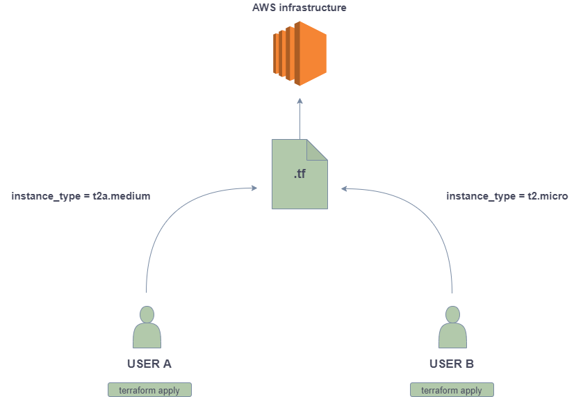

# Hands-on Terraform-03: Terraform Data Sources, Remote Backend, and Provisioners.

The purpose of this hands-on training is to give students the knowledge of Terraform data sources, remote backend, and provisioners in Terraform.

## Learning Outcomes

At the end of this hands-on training, students will be able to;

- Use terraform data sources.
- Create a remote backend.
- Use terraform provisioners.

## Outline

- Part 1 - Terraform Data Sources

- Part 2 - Remote Backend

- Part 3 - Terraform Provisioners

## Part 1 - Terraform Data Sources

- `Data sources` allow data to be fetched or computed for use elsewhere in the Terraform configuration.

- Go to the `AWS console and create an image` from your EC2. Select your instance and from actions click image and templates, and then give a name for ami `my-ami` and click create. 

# It will take some time. go to the next steps.

-  Create a directory ("tf-data") for the new configuration and change into the directory.

```bash
mkdir tf-data && cd tf-data && touch main.tf
```

- Go to the `main.tf` file and make the changes in order.

```go
provider "aws" {
  region  = "us-east-1"
}

terraform {
  required_providers {
    aws = {
      source = "hashicorp/aws"
      version = "6.0.0"
    }
  }
}

locals {
  mytag = "local-name"
}

data "aws_ami" "tf_ami" {
  most_recent      = true
  owners           = ["self"]

  filter {
    name = "virtualization-type"
    values = ["hvm"]
  }
}

variable "ec2_type" {
  default = "t2.micro"
}

resource "aws_instance" "tf-ec2" {
  ami           = data.aws_ami.tf_ami.id
  instance_type = var.ec2_type
  key_name      = "mykey"
  tags = {
    Name = "${local.mytag}-this is from my-ami"
  }
}
```

```bash
terraform plan
```

```bash
terraform apply
```

- Check the EC2 instance's ami ID.

- You can see which data sources can be used with a resource in the documentation of Terraform, for example EBS snapshot.

```bash
terraform destroy
```

## Part 2 - Terraform Remote State (Remote backend)

- A `backend` in Terraform determines how the tfstate file is loaded/stored and how an operation such as apply is executed. This abstraction enables non-local file state storage, remote execution, etc. By default, Terraform uses the "local" backend, which is the normal behavior of Terraform you're used to.

- Go to the AWS console and attach ``DynamoDBFullAccess`` policy to the existing role.



- Create a new folder named  `s3-backend` and a file named `backend.tf`. 

```txt
    s3-backend
       └── backend.tf
    terraform-aws
       ├── main.tf
     
```

- Go to the `s3-backend` folder and create a file named `backend.tf`. Add the following.

```bash
cd && mkdir s3-backend && cd s3-backend && touch backend.tf
```

```go
provider "aws" {
  region = "us-east-1"
}

resource "aws_s3_bucket" "tf-remote-state" {
  bucket = "tf-remote-s3-bucket--changehere"

  force_destroy = true # Normally it must be false. Because if we delete s3 mistakenly, we lost all of the states.
}


resource "aws_s3_bucket_versioning" "versioning_backend_s3" {
  bucket = aws_s3_bucket.tf-remote-state.id
  versioning_configuration {
    status = "Enabled"
  }
}


```

- Run the commands below.

```bash
terraform init   

terraform apply
```

- We have created an S3 bucket and a DynamoDB table. Now associate the S3 bucket with the Dynamodb table.

- Go to the `main.tf` file under /tf-data/ folder and make the changes.

```go
terraform {

  required_providers {
    aws = {
      source = "hashicorp/aws"
      version = "6.0.0"
    }
  }

  backend "s3" {
    bucket = "tf-remote-s3-bucket-changehere"
    key = "env/dev/tf-remote-backend.tfstate"
    region = "us-east-1"
    encrypt = true
    use_lockfile = true
  }
}
```

- Go to the `tf-data` directory and run the commands below. First, try to terraform apply command.

```bash
cd ../tf-data
```

```bash
terraform apply  

terraform init  

terraform apply
```

- Because of using an S3 bucket for the backend, run `terraform init` again. It will ask you to copy the existing tfstate file to S3. yes.

- Go to the AWS console and check the S3 bucket and tfstate file. tfstate file is copied from local to S3 backend.

- Go to the `main.tf` file, add the following, and check the versioning on the AWS S3 console.

```go
resource "aws_s3_bucket" "tf-test-1" {
  bucket = "test-1-versioning"
}
```

```bash
terraform apply
```

- Go to the `main.tf` file, make the changes.

```go
resource "aws_s3_bucket" "tf-test-2" {
  bucket = "test-2-locking-2"
}
```

- Open a new terminal. Write `terraform apply` in both terminals. Try to run the command in both terminals at the same time.

- We do not get an error in the terminal when we run `terraform apply` command for the first time, but we get an error in the terminal when we run it later.

- Now you can try to run the same command in the second terminal. Check the Dynamo DB table and items.

- Destroy all resources. (Run the command in the `terraform-aws` and `s3-backend` folders.)

```bash
terraform destroy   
cd ../s3-backend/
terraform destroy
```

- Do not forget to delete ami and snapshot from the AWS console.

## Part 3 - Terraform Provisioners

- Provisioners can be used to model specific actions on the local machine or a remote machine to prepare servers or other infrastructure objects for service.

- The `local-exec` provisioner invokes a local executable after a resource is created. This invokes a process on the machine running Terraform, not on the resource.

- The `remote-exec` provisioner invokes a script on a remote resource after it is created. This can be used to run a configuration management tool, bootstrap into a cluster, etc. To invoke a local process, see the local-exec provisioner instead. The remote-exec provisioner supports both ssh and winrm type connections.

- The `file` provisioner is used to copy files or directories from the machine executing Terraform to the newly created resource. The file provisioner supports both ssh and winrm type connections.

- Most provisioners require access to the remote resource via SSH or WinRM, and expect a nested connection block with details about how to connect. Connection blocks don't take a block label and can be nested within either a resource or a provisioner.

- The `self` object represents the provisioner's parent resource, and has all of that resource's attributes. For example, use `self.public_ip` to reference an aws_instance's public_ip attribute.

- Take your `pem file` to your local instance's home folder for using `remote-exec` provisioner.

- Go to your local machine and run the following command. 

```bash
scp -i ~/.ssh/<your pem file> <your pem file> ec2-user@<terraform instance public ip>:/home/ec2-user
```

- Or you can drag and drop your pem file to VS Code. Then, change the permissions of the pem file.

```bash
chmod 400 <your pem file>
```

- Create a folder named `provisioners` and create a file named `main.tf`. Add the following.

```bash
cd && mkdir provisioners && cd provisioners && touch main.tf
```

```go
terraform {
  required_providers {
    aws = {
      source = "hashicorp/aws"
      version = "~>6.0"
    }
  }
}

provider "aws" {
  region = "us-east-1"
}

resource "aws_instance" "instance" {
  ami = "ami-09e6f87a47903347c"
  instance_type = "t2.micro"
  key_name = "mykey"
  vpc_security_group_ids = [ aws_security_group.tf-sec-gr.id ]
  tags = {
    Name = "terraform-instance-with-provisioner"
  }

  provisioner "local-exec" {
      command = "echo http://${self.public_ip} > public_ip.txt"
  
  }

  connection {
    host = self.public_ip
    type = "ssh"
    user = "ec2-user"
    private_key = file("~/mykey.pem")
  }

  provisioner "remote-exec" {
    inline = [
      "sudo dnf -y install httpd",
      "sudo systemctl enable httpd",
      "sudo systemctl start httpd"
    ]
  }

  provisioner "file" {
    content = self.public_ip
    destination = "/home/ec2-user/my_public_ip.txt"
  }

}

resource "aws_security_group" "tf-sec-gr" {
  name = "tf-provisioner-sg"
  tags = {
    Name = "tf-provisioner-sg"
  }

  ingress {
    from_port   = 80
    protocol    = "tcp"
    to_port     = 80
    cidr_blocks = ["0.0.0.0/0"]
  }

  ingress {
      from_port = 22
      protocol = "tcp"
      to_port = 22
      cidr_blocks = [ "0.0.0.0/0" ]
  }

  egress {
      from_port = 0
      protocol = -1
      to_port = 0
      cidr_blocks = [ "0.0.0.0/0" ]
  }
}
```

- Go to the Provisioners folder and run the terraform file.

```bash
terraform init
terraform apply
```

- Check the resources that were created by Terraform.

- Terminate the resources.

```bash
terraform destroy
```
