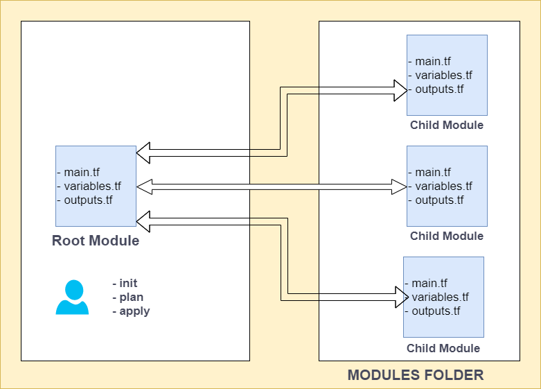

# Hands-on Terraform-04: Terraform Modules and import.

The purpose of this hands-on training is to give students the knowledge of Terraform modules and import them into Terraform.

## Learning Outcomes

At the end of this hands-on training, students will be able to;

- Use Terraform modules.

- Use Terraform import.

## Outline

- Part 1 - Terraform Modules

- Part 2 - Terraform Import

## Part 1 - Terraform Modules

- A module is a container for multiple resources that are used together.

- The ``.tf`` files in your working directory when you run terraform plan or terraform apply together from the root module. That module may call other modules and connect them together by passing output values from one to the input values of another.

- Create folders named `terraform-modules`, `modules`, `dev`, `prod` directories in the home directory and files as below.

```bash
mkdir terraform-modules && cd terraform-modules && mkdir dev modules prod && cd dev && touch dev-vpc.tf && cd ../modules && touch main.tf outputs.tf variables.tf && cd ../prod && touch prod-vpc.tf && cd ../modules
```

```txt
 terraform-modules
   ├── dev
   │   └── dev-vpc.tf
   ├── modules
   │   ├── main.tf
   │   ├── outputs.tf
   │   └── variables.tf
   └── prod
       └── prod-vpc.tf
```



- Go to the `modules/main.tf` file, and add the following.

```go
provider "aws" {
  region = "us-east-1"
}

resource "aws_vpc" "module_vpc" {
  cidr_block = var.vpc_cidr_block
  tags = {
    Name = "terraform-vpc-${var.environment}"
  }
}

resource "aws_subnet" "public_subnet" {
  cidr_block = var.public_subnet_cidr
  vpc_id = aws_vpc.module_vpc.id
  tags = {
    Name = "terraform-public-subnet-${var.environment}"
  }
}

resource "aws_subnet" "private_subnet" {
  cidr_block = var.private_subnet_cidr
  vpc_id = aws_vpc.module_vpc.id
  tags = {
    Name = "terraform-private-subnet-${var.environment}"
  }
}
```

- This is not a public subnet since we didn't attach an internet gateway. 

- Go to the `modules/variables.tf` file, and add the following.

```go
variable "environment" {
  default = "mycompany"
}

variable "vpc_cidr_block" {
  default = "10.0.0.0/16"
  description = "this is our vpc cidr block"
}

variable "public_subnet_cidr" {
  default = "10.0.1.0/24"
  description = "this is our public subnet cidr block"
}

variable "private_subnet_cidr" {
  default = "10.0.2.0/24"
  description = "this is our private subnet cidr block"
}
```

- Go to the `modules/outputs.tf` file, and add the following.

```go
output "vpc_id" {
  value = aws_vpc.module_vpc.id
}

output "vpc_cidr" {
  value = aws_vpc.module_vpc.cidr_block
}

output "public_subnet_cidr" {
  value = aws_subnet.public_subnet.cidr_block
}

output "private_subnet_cidr" {
  value = aws_subnet.private_subnet.cidr_block
}
```

- Go to the `dev/dev-vpc.tf` file, and add the following.

```go
module "tf-vpc" {
  source = "../modules"
  environment = "DEV"
  }

output "vpc-cidr-block" {
  value = module.tf-vpc.vpc_cidr
}
```

- Go to the `prod/prod-vpc.tf` file, and add the following.

```go
module "tf-vpc" {
  source = "../modules"
  environment = "PROD"
  }

output "vpc-cidr-block" {
  value = module.tf-vpc.vpc_cidr
}
```

- Go to the `dev` folder and run the command below.

```bash
terraform init

terraform apply
```

- Go to the AWS console and check the VPC and subnets.

- Go to the `prod` folder and run the command below.

```bash
terraform init

terraform apply
```

- Go to the AWS console and check the VPC and subnets.

### Destroy

The `terraform destroy` command terminates resources defined in your Terraform configuration. This command is the reverse of terraform apply in that it terminates all the resources specified by the configuration. It does not destroy resources running elsewhere that are not described in the current configuration. 

- Go to the `prod` and  `dev` folders and run the command below.

```bash
terraform destroy -auto-approve
```

## Part 2 - Terraform Import

- Terraform is able to import existing infrastructure. 

- In this example, we have 1 Ubuntu EC2 instance in our AWS account and we want to import this resource to our infrastructure.

- Bringing existing infrastructure under Terraform's control involves five main steps:

  1. Identify the existing infrastructure to be imported.
  2. Write a Terraform configuration that matches that infrastructure.
  3. Import infrastructure into your Terraform state.
  4. Review the Terraform plan to ensure the configuration matches the expected state and infrastructure.
  5. Apply the configuration to update your Terraform state.

- First, go to the AWS console and create an EC2 instance ami is `Ubuntu 24.04` and tag is `Name=ubuntu-24.04`.

- Create a folder named `terraform-import` and enter the directory.

```bash
cd && mkdir terraform-import && cd terraform-import
```

- Create a file name `main.tf`. Add the following according to the existing resource.

```
vim main.tf
```

```go
# main.tf

terraform {
  required_providers {
    aws = {
      source = "hashicorp/aws"
      version = "5.49.0"
    }
  }
}

provider "aws" {
  region = "us-east-1"
}

resource "aws_instance" "tf-instances" {
  ami = "ami-04b70fa74e45c3917"
  instance_type = "t2.micro"
  key_name = "mykey"            // change here
  tags = {
    Name = "ubuntu-24.04"
  }
}
```

- Open the terminal within this directory and initialize Terraform.

```bash
terraform init
```

- Import the Ubuntu instance. (Take the Ubuntu 24.04 instance ID from the console)

```bash
$ terraform import "aws_instance.tf-instances" i-092fe70d1cef163c1


aws_instance.tf-instances[1]: Importing from ID "i-092fe70d1cef163c1"...
aws_instance.tf-instances[1]: Import prepared!
  Prepared aws_instance for import
aws_instance.tf-instances[1]: Refreshing state... [id=i-092fe70d1cef163c1]

Import successful!

The imported resources are shown above. These resources are now in
your Terraform state and will henceforth be managed by Terraform.
```

- Check the terraform.tfstate.

```bash
terraform state list
```

- Go to the terminal and run the commands `terraform plan` and `terraform apply`.

```bash
terraform plan
terraform apply
```

- Import is successful. Go to the terminal and terminate your infrastructure.

```bash
terraform destroy
```

### Terraform Import Block

- Launch a `t2.micro` EC2 instance with `Amazon Linux 2023` ami.

- Update the `main.tf` file as below.

```go
import {
  to = aws_instance.example
  id = "i-0d783f4cdae5f40d8"
}

resource "aws_instance" "example" {
  ami = "ami-0bb84b8ffd87024d8"
  instance_type = "t2.micro"
  # (resource arguments...)
}
```

- Run the commands `terraform plan` and `terraform apply`.

```bash
terraform plan

terraform apply
```

- Check the terraform.tfstate. The EC2 instance is now in your Terraform state.

```bash
terraform state list
```

- Import is successful. Go to the terminal and terminate your infrastructure.

```bash
terraform destroy
```

> Note: The import block records that Terraform imported the resource and did not create it. After importing, you can optionally remove import blocks from your configuration or leave them as a record of the resource's origin.

### -generate-config-out

> Experimental: While we do not expect to make backward-incompatible changes to syntax, the -generate-config-out flag and how Terraform processes imports during the plan stage and generates configuration may change in future releases.

- Let's produce a configuration file using the `-generate-config-out` option.

- Go to the AWS console and create a security group named `terraform-sg`.

- Update the `main.tf` file as below.

```go
import {
  to = aws_security_group.mysg
  id = "sg-04857a39a743f07c2"
}
```

- Produce a configuration file for `terraform-sg` security group.

```bash
terraform plan -generate-config-out=terraform-sg.tf
```

- Check the `terraform-sg.tf` file.

- Run the commands `terraform plan` and `terraform apply`.

```bash
terraform plan

terraform apply
```

- Check the terraform.tfstate. The sg is now in your Terraform state.

```bash
terraform state list
```

- Import is successful. Go to the terminal and terminate your infrastructure.

```bash
terraform destroy
```
